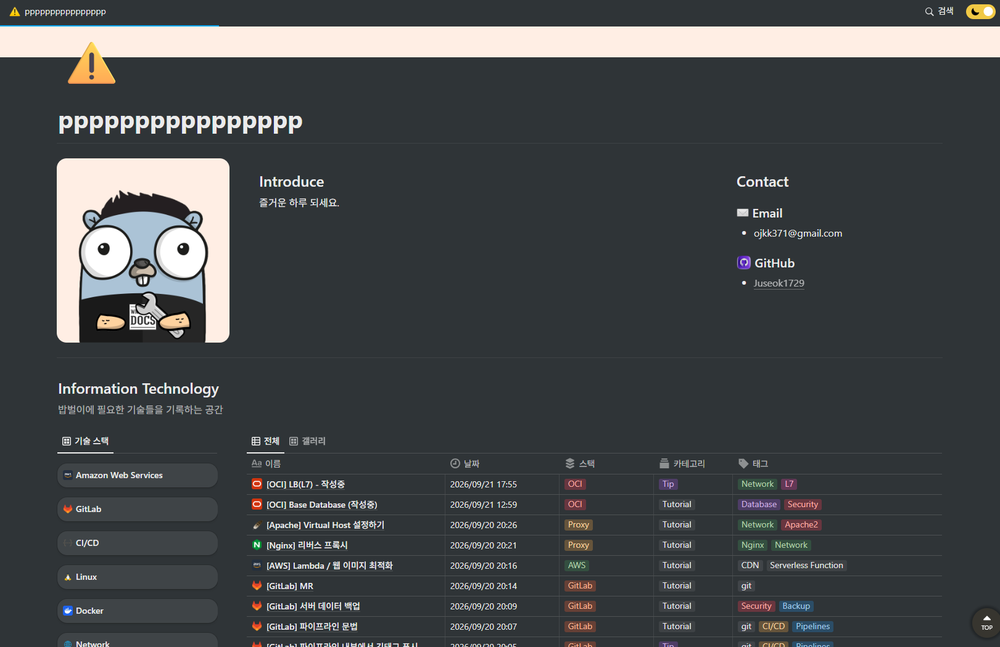
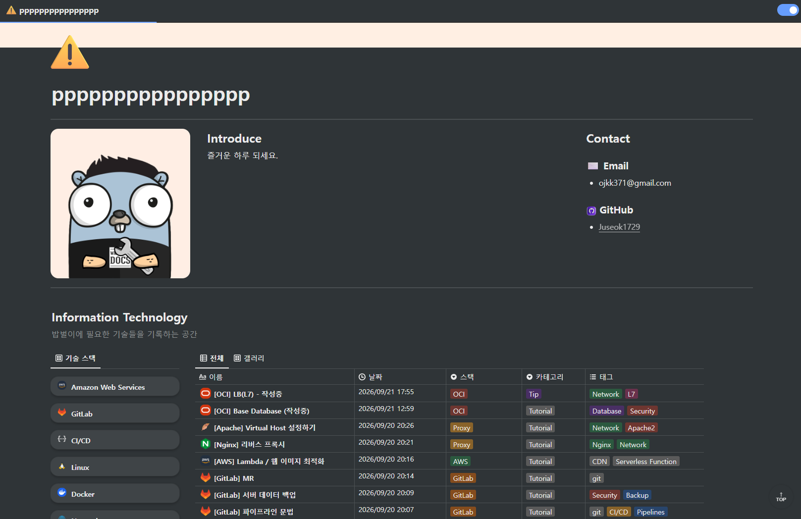

# OOCI — Notion → 웹사이트 렌더러 (oopy 스타일, OCI 셀프호스팅)

공개 Notion 페이지를 oopy 기본 테마로 렌더링하고, 커스텀 도메인/서브도메인을 붙여 여러 사람(팀원)의 사이트를 한 서버에서 서비스합니다.

## 렌더링 비교

같은 Notion 페이지를 oopy(왼쪽)와 이 프로젝트(오른쪽)로 렌더링한 결과입니다.

| oopy | OOCI |
|---|---|
|  |  |

## 구성

| 항목 | 내용 |
|---|---|
| 앱 | Next.js 16 (App Router, SSR) + React 19 + react-notion-x |
| Notion 데이터 | `notion-client` (공개 페이지는 토큰 불필요) |
| DB | Oracle (OCI BYOL DB System), `oracledb` thin 모드 (Instant Client 불필요) |
| 사이트 식별 | `Host` 헤더 → `sites.custom_domain` 또는 `<slug>.BASE_DOMAIN` |
| 캐시 | 프로세스 메모리, `PAGE_TTL`초, stale-while-revalidate |

```
src/app/[[...slug]]/page.tsx   호스트→사이트→Notion 페이지 해석, SSR, 메타태그
src/components/OopyShell.tsx   oopy 셸: 상단 메뉴바, 브레드크럼, 모바일 드로어, 다크모드
src/app/globals.css            oopy 기본 테마 (900px 페이지 / 96px 여백 / 48px 탑바 등)
src/app/admin/page.tsx         사이트 등록/수정 (ADMIN_TOKEN 로그인)
src/app/api/purge/route.ts     POST, Bearer ADMIN_TOKEN → 페이지 캐시 비우기
src/lib/{db,sites,notion,resolve}.ts
db/schema.sql                  SITES, PAGE_ALIASES
```

## 로컬 실행

```bash
cp .env.example .env         # Oracle 없이 보려면 ORACLE_CONNECT_STRING 비우고 DEV_ROOT_PAGE 설정
npm install
npm run dev                  # http://localhost:3000
npm run check                # tsc + 테스트
```

Oracle까지 로컬에서: `docker compose up` (Oracle Free 이미지가 `db/schema.sql`을 자동 실행).

## OCI 배포 (인프라는 별도)

1. DB System(BYOL)에 `db/schema.sql` 실행, 앱 유저 생성.
2. `docker build -t ooci .` → OCIR push → Compute/OKE에서 `.env` 값으로 실행 (포트 3000).
3. Load Balancer(HTTPS 종단) → 앱. 와일드카드 인증서 `*.BASE_DOMAIN` + 커스텀 도메인은 각각 인증서 추가.
4. DNS: `*.BASE_DOMAIN` A/CNAME → LB. 팀원 커스텀 도메인은 CNAME → LB.

## 사이트 등록

`https://<아무 호스트>/admin` → `ADMIN_TOKEN` 로그인 → slug, 커스텀 도메인, Notion 루트 페이지(공개 필수), URL alias, settings JSON.

settings 예:
```json
{ "menu": [{ "title": "Blog", "href": "/blog" }, { "title": "About", "href": "/about" }],
  "font": "Pretendard", "brandColor": "#669DFD", "footer": "© 2026 me",
  "customCss": ".notion-title{letter-spacing:-.02em}" }
```
`menu`를 비우면 루트 페이지의 하위 페이지가 자동 메뉴가 됩니다. 루트 하위가 아닌 페이지는 404입니다.
